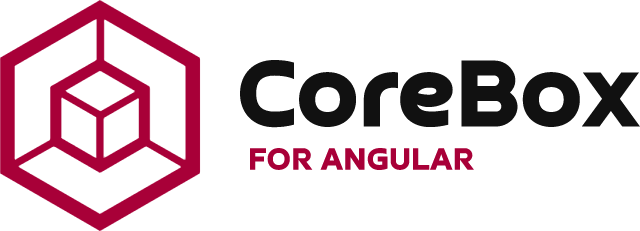
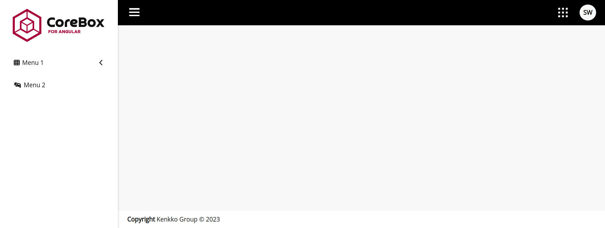
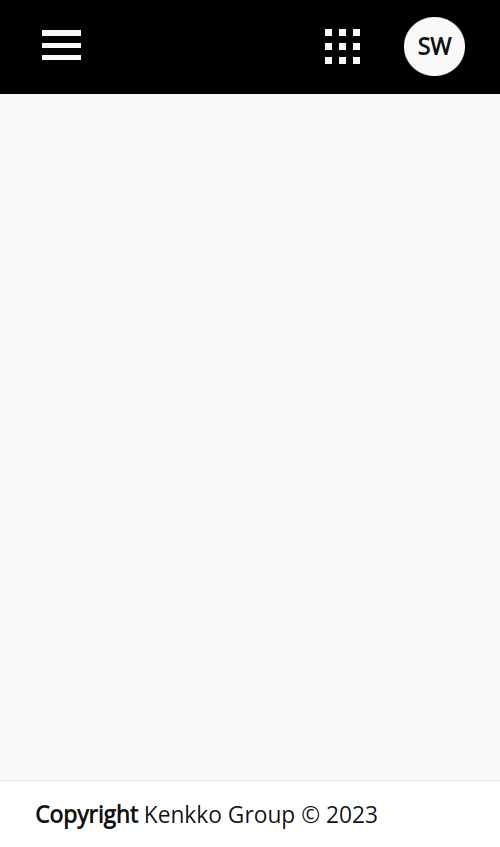

<p align="center">
  
  <h1 align="center">ngx-corebox</h1>
  <p align="center">A library with the base template your application needs. Built natively in angular and javascript only.</p>
</p>

## Features

- Responsive base template with 
    - Menu;
    - Header;
    - Footer;
    - Profile settings;
    - Apps menu;
    - Delimited content.

## Roadmap

- Template selection
- Notifications
- Switch font-size


## Install

```bash
npm i @kenkko.group/ngx-corebox
```

Import `NgxCoreboxModule` in in the root module(`AppModule`):
```js
import { NgModule } from '@angular/core';
import { BrowserModule } from '@angular/platform-browser';
// Import library module
import { NgxCoreboxModule } from 'ngx-corebox';

@NgModule({
  imports: [
    BrowserModule,
    NgxCoreboxModule
  ]
})
export class AppModule { }

```

## Usage

In `app.component.ts` fill in the fields bellow:

```js
appItems: AppItem[] = [
    {
        title: '<Set app title>',
        url: '<Set app route or absolute url>',
        icon: '<Set icon based on font awesome icons>'
    } as AppItem
];

menuItems: MenuItem[] = [
    {
        title: '<Set menu title>',
        url: '<Set menu route or absolute url>',
        icon: '<Set icon based on font awesome icons>',
        children: [{
            title: '<Set submenu title>',
            url: '<Set submenu route or absolute url>',
            icon: '<Set icon based on font awesome icons>'
        }]
    } as MenuItem,
    {
        title: '<Set menu title>',
        url: '<Set menu route or absolute url>',
        icon: '<Set icon based on font awesome icons>',
    } as MenuItem
];

profileOptions = {
    companyName: '<Set company name>',
    userName: '<Set username>',
    profileUrl: '<Set profile update url>',
    profileIcon: '<Set icon based on font awesome icons>',
    profileLabel: '<Set profile label>',
    logoutIcon: '<Set icon based on font awesome icons>',
    logoutLabel: '<Set logout label>',
    logoutEvent: '<Set your arrow function for logout. Ex: logoutEvent: () => { myLogoutFunction(); } >'
} as ProfileOptions;

themes = [
    {
      selected: true,
      name: '<Set theme name>',
      logo: '<Set logo path>',
      logoMobile: '<Set mobile logo path>',
      backgroundColor: '<Set your color theme>',
      scrollColor: '<Set your color theme>',
      header: {
        backgroundColor1: '<Set your color theme>',
        iconBackgroundColor: '<Set your color theme>',
        iconFontColor: '<Set your color theme>',
        borderShadowColor: '<Set your color theme>'
      },
      menu: {
        fontColor: '<Set your color theme>',
        fontHoverColor: '<Set your color theme>',
        backgroundColor: '<Set your color theme>',
        backgroundHoverColor: '<Set your color theme>',
        borderLeftColor: '<Set your color theme>',
        subMenuBackgroundColor: '<Set your color theme>',
        subMenuSelectedBackgroundColor: '<Set your color theme>',
        menuSelectedFontColor: '<Set your color theme>'
      } as Menu,
      footer: {
        backgroundColor: '<Set your color theme>',
        fontColor: '<Set your color theme>',
        borderTopColor: '<Set your color theme>'
      } as Footer
    } as Theme
  ];
```


Add the code bellow in your `app.component.html` and voilà:

```html
<corebox-template
    [themes]="themes"
    [profileOptions]="profileOptions"
    [menuItems]="menuItems"
    [appItems]="appItems"
>
</corebox-template>
```
<p style="display:flex;justify-content:space-between;">
    
    
</p>

## How to run

- Clone the repository

- Go to project root folder

- Install dependencies
    ```bash 
    npm i
    ```

- Open 2 terminals and run
    ```bash 
    npm run watch ngx-corebox

    npm start labs
    ```

- Open your browser at http://localhost:4200

**Thanks for contributions <3**
## License

ngx-corebox is [MIT licensed](./LICENSE).
